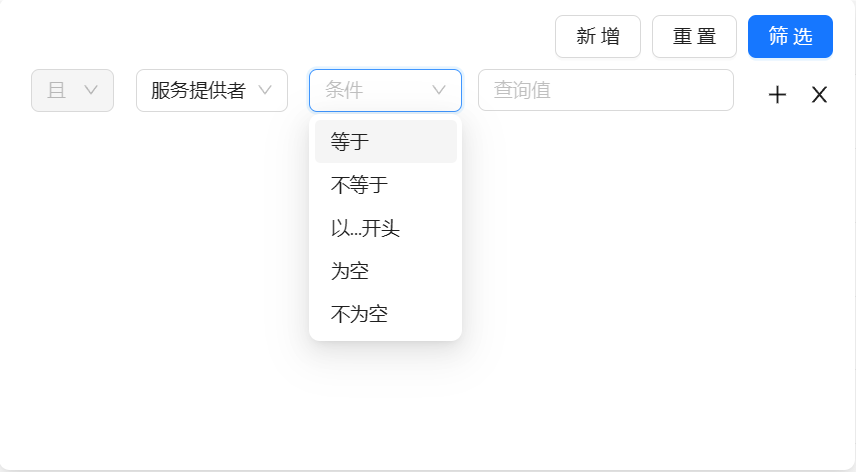

# 初级查询组件



一个非常常见的需求 —— 为列表提供初级搜索功能。为该功能定义了 `CommonQuery` 组件。

## Example

```java
package io.github.xezzon.geom.open.adaptor;

import io.github.xezzon.geom.open.domain.PublicApi;
import io.github.xezzon.tao.retrieval.CommonQuery;
import org.springframework.data.domain.Page;
import org.springframework.web.bind.annotation.GetMapping;
import org.springframework.web.bind.annotation.RequestMapping;
import org.springframework.web.bind.annotation.RestController;

@RestController
@RequestMapping("/public-api")
public class PublicApiController {

  @GetMapping()
  public Page<PublicApi> list(CommonQuery commonQuery) {
    // TODO
    return null;
  }
}
```

此时，我们的请求应该是类似这样的: `GET /public-api?filter=(type+EQ+%27RPC%27)+AND+((name+EQ+%27hello%27+AND+code+LLIKE+%27world%27))&sort=&pageNum=1&pageSize=10`。（其实也可以通过 POST 请求 + `@RequestBody` 的方式使用，虽然并不建议这样做。）

## CommonQuery 的 3 个部分

### 排序

调用 `CommonQuery#parseSort()`，返回一个 `CommonQuerySort` 对象列表。

### 分页

调用 `CommonQuery#getPageSize()` 和 `CommonQuery#getPageNum()` 分别获取 每页大小 和 页码。

约定：`pageNum` 从 1 开始，`pageSize` 小于等于0时不分页。

### 过滤

调用 `CommonQuery#parseFilter()`，返回由 `antlr` 定义的抽象语法树。具体语法见[过滤语法](#过滤语法)章节。

## 过滤语法

对列表的过滤是通过 `antlr` 定义了一套小型的语法实现的（类似于SQL语句）。语法规则如下：
`(FIELD1 OP1 VALUE1) CONJ1 ((FIELD2 OP2 VALUE2) CONJ2 (FIELD3 OP3 VALUE3))`

`FIELD` 是实体字段名。

`VALUE` 是值。可以是字符串（需要用`''`包裹）、数值、布尔类型（`true`、`false`）。列表作为字符串的一个特例，以`,`分割的字符串可以视为列表。日期时间类型作为字符串的另一个特例，需要以`yyyy-MM-ddTHH:mm:ss`格式被解析。

`OP` 是操作符。目前支持的操作符有 `EQ`（等于，支持所有值类型）、`NE`（不等于，支持所有值类型）、`LLIKE`（左包含，仅支持字符串）、`IN`（值在范围内，仅支持列表类型）、`OUT`（值在范围外，仅支持列表类型）、`GT`（大于，支持数值类型、日期时间类型）、`LT`（小于，支持数值类型、日期时间类型）、`GE`（大于等于，支持数值类型、日期时间类型）、`LE`（小于等于，支持数值类型、日期时间类型）、`NULL`（是否为NULL值，值为布尔类型）。

`CONJ` 是连接符。取值为 `AND`/`OR`。

## JPA 扩展

tao-core 中只定义了抽象，[JPA 扩展](https://github.com/xezzon/tao-addon-jpa) 提供了对 CommonQuery 的 JPA 实现，包括了将排序和分页解析为 `Pageable` 对象、将过滤解析为查询语句。
